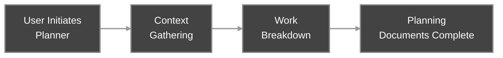
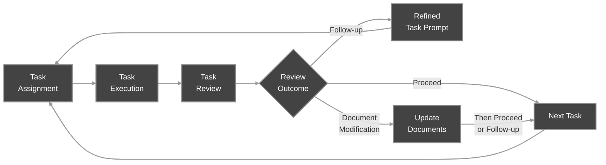
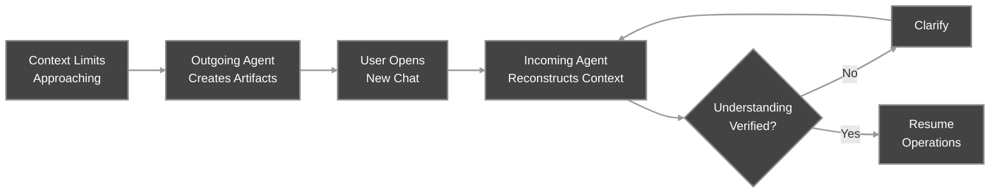

# Agent Orchestration

APM coordinates multiple Agent instances through file-based communication and structured memory. This architecture enables Agents to work together without direct programmatic connection, making the workflow platform-agnostic and all interactions auditable.

---

## Agent Relationships

The framework establishes a coordination hierarchy where Agents interact through defined channels:

**Planner ↔ User → Manager**

- Planner creates planning documents during Planning Phase
- User reviews, requests modifications if needed and approves, then initializes Manager for Implementation Phase
- No ongoing relationship - Planner completes and exits

**Manager ↔ Workers (via User)**

- Manager assigns tasks by writing Task Prompts to Task Bus files
- User runs `/apm-4-check-tasks` in Worker chats to deliver assignments
- Workers execute tasks and write Task Reports to Report Bus files
- User runs `/apm-5-check-reports` in Manager's chat to deliver reports
- Manager reviews and determines review outcome

**Outgoing Agent → Incoming Agent (via User)**

- Outgoing Agent creates Handoff Log and handoff prompt
- User initializes new chat; incoming Agent auto-detects handoff prompt
- Incoming Agent reconstructs context and continues work

**All Agents ↔ Planning Documents**

- Planner creates all three planning documents
- Manager reads all three, extracts from the Spec and Plan into Task Prompts, may update all three
- Workers read Rules directly (via platform's agents file), receive extracted context via Task Prompts, may update Rules

---

## Bus System

The bus system in `.apm/bus/` provides file-based communication between Agents. The Planner initializes it at the end of the Planning Phase, creating agent directories for each Worker defined in the Plan. The Manager has a bus directory containing only a Handoff Bus.

### Bus File Types

Each Worker's agent directory contains three bus files:

**Task Bus** (`task.md`)

- Manager writes Task Prompts (single or batched)
- Worker reads to receive assignments
- Direction: Manager → Worker

**Report Bus** (`report.md`)

- Worker writes Task Reports (single or batched)
- Manager reads to review outcomes
- Direction: Worker → Manager

**Handoff Bus** (`handoff.md`)

- Outgoing Agent writes handoff prompt
- Incoming Agent reads to reconstruct context
- Direction: Outgoing Agent → Incoming Agent

### Clear-on-Return Protocol

Before writing to an outgoing bus file, an Agent clears its incoming bus file. This prevents stale messages from accumulating and signals message processing completion.

Example: Worker clears Task Bus before writing to Report Bus.

### Message Flow

All communication requires User as trigger puller. For example:

1. Manager writes Task Prompt to Worker's Task Bus
2. User runs `/apm-4-check-tasks` in Worker's chat
3. Worker executes, clears Task Bus, writes Task Report to Report Bus
4. User runs `/apm-5-check-reports` in Manager's chat
5. Manager reads Report, clears Report Bus, determines review outcome

This user-mediated model works universally across platforms without requiring tool-specific integrations.

---

## Memory

Memory resides in `.apm/` and tracks project state and execution history through a hierarchical structure. Workers document their work, the Manager reviews logs and tracks coordination state, and all Agents use this archive for context reconstruction during Handoff.

### Tracker

**Location:** `.apm/tracker.md`

Live project state document containing:

- **Task tracking** - Task statuses per Stage (Waiting, Ready, Active, Done), agent assignments, active branches, merge state; updated by Manager after each Task Review
- **Agent tracking** - Agent identifiers, instance numbers, and notes; updated when agents are dispatched to or Handoffs are detected
- **Version control state** - Base branch, branch convention, active branches, pending merges
- **Working notes** - Ephemeral coordination notes maintained by Manager and User, inserted and removed as context evolves

The Manager populates the Tracker during the first initialization and updates it after each Task Review.

### Index

**Location:** `.apm/memory/index.md`

Durable project memory containing:

- **Memory notes** - Persistent observations and patterns with lasting value, placed first so incoming Managers encounter durable knowledge immediately
- **Stage summaries** - Stage-level outcomes appended after each Stage completes

The Manager initializes the Index during the first initialization and appends stage summaries as Stages complete.

### Task Logs

**Location:** `.apm/memory/stage-<NN>/task-<NN>-<MM>.log.md`

Structured logs created by Workers after Task completion. Each log documents:

- Task status (Success, Partial, Failed, Blocked)
- Validation results per specified criteria
- Deliverables and file changes
- Technical decisions made during execution
- Flags for Manager attention (important_findings, compatibility_issues)

Task Logs serve as context abstraction layer - the Manager reads logs to understand outcomes without reviewing code and other output directly. During Handoff, incoming Agents read relevant logs to reconstruct context.

Workers create the stage directory when writing their first log for that Stage.

### Handoff Logs

**Location:** `.apm/memory/handoffs/<agent>/handoff-<NN>.log.md`

Logs created during Handoff capturing working context not recorded elsewhere:

- Effective workflow patterns discovered during execution
- User preferences observed during collaboration
- Undocumented insights about codebase or project
- Current execution context if Handoff occurs mid-task
- Version control state (active branches, worktrees, pending merges)

Incoming Agents read the Handoff Log during context reconstruction to resume seamlessly.

### Session Archives

**Location:** `.apm/archives/`

Archived sessions preserved for future reference. Each archive contains the session's planning documents, Tracker, Memory, and an optional session summary. Archives accumulate across sessions and are accessible to future Planners during Context Gathering via the `apm-archive-explorer` custom subagent.

### Memory as Context Archive

As the project progresses, Memory becomes a comprehensive archive mapping the Plan to execution history. This structured mapping enables:

- **Efficient Handoff** - Incoming Agents reconstruct context from the Tracker and Index (if Manager), Handoff Log, and relevant Task Logs rather than full conversation history
- **Cross-Agent Context** - Workers integrate outputs from other Agents by reading specified Task Logs as instructed in Task Prompts
- **Progress Tracking** - Manager assesses project state by reading stage summaries in the Index and task tracking in the Tracker rather than reviewing all code changes

---

## Context Scoping

APM achieves Agent specialization through intentional context boundaries. Each Agent sees only the information relevant to its role.

### Planner

**Access:**

- User-provided requirements and existing documentation
- Codebase if applicable
- Full project vision during Planning Phase
- Session archives (`.apm/archives/`) when present — explored via `apm-archive-explorer` custom subagent

**Does not access:**

- Memory (does not exist yet for current session)
- Bus system (does not exist yet)
- Implementation Phase activities

Single instance, no Handoff.

### Manager

**Access:**

- All planning documents (reads, may update)
- Tracker and Index
- All Task Logs
- Bus system (all Task/Report/Handoff buses)
- Version control state during parallel dispatch

**Does not access:**

- Worker's detailed execution context (reads Task Logs instead of code)
- Task-level implementation details unless investigation requires it or User requests it

Multiple instances via Handoff. Each instance continues from where previous left off using Handoff Log and Memory.

### Worker

**Access:**

- Current Task Prompt (includes extracted Spec context, instructions, validation criteria)
- Rules directly (via platform's agents file)
- Accumulated working context from prior same-agent tasks in current Stage
- Specified Task Logs when cross-agent dependencies exist

**Does not reference directly:**

- Spec (receives extracted context via Task Prompt - Manager embeds all necessary content)
- Plan (receives Task definition via Task Prompt)
- Tracker, Index, or stage summaries
- Other Workers' working context unless explicitly provided in Task Prompt

Multiple instances via Handoff. After Handoff, incoming Worker reads current-Stage Task Logs for their Agent to reconstruct working context.

---

## Handoff Mechanism

When an Agent's context window approaches limits (70-80% capacity), Handoff transfers working context to a fresh instance. This enables sustained project execution beyond single-instance capacity.

### Why Handoff Works

Traditional context compaction accumulates noise - debugging attempts, trial-and-error, intermediate reasoning. Handoff filters this noise through structured artifacts:

- **Memory** (Tracker, Index, Task Logs) preserves execution outcomes and coordination state
- **Handoff Log** preserves working knowledge and undocumented insights

The Incoming Agent inherits clean context without noise, enabling multiple consecutive handoffs without degradation.

### Handoff Eligibility

**Manager:**

- May Handoff at any point as long as the Handoff Prompt captures comprehensive current state
- Documentation completeness is the requirement, not workflow stage

**Worker:**

- May Handoff between tasks or mid-task
- Must document current execution context in detail in Handoff Log if mid-task

### Two-Artifact Handoff System

**Handoff Log**

- Created by outgoing Agent
- Captures uncommitted knowledge not in formal logs
- Includes working patterns, User preferences, undocumented state, current execution context (if Worker), version control state (if Manager)

**Handoff Prompt**

- Created by outgoing Agent, written to Handoff Bus
- Instructs incoming Agent on context reconstruction
- Specifies which artifacts to read (Handoff Log, relevant Task Logs)
- Includes verification step before resuming operations

### Context Reconstruction

**Incoming Manager reads:**

- All planning documents
- Tracker (task tracking, agent tracking, working notes)
- Index (memory notes, stage summaries)
- Handoff Log
- Relevant recent Task Logs

**Incoming Worker reads:**

- Rules (via platform's agents file)
- Current-Stage Task Logs for their agent
- Handoff Log

Previous-Stage logs are not loaded for efficiency — the Manager accounts for this by treating previous-Stage same-agent dependencies as cross-agent dependencies (providing file reading instructions in Task Prompts). These cross-agent overrides are recorded in the Tracker so the Manager can reference them during future Task Assignments.

### Recovery

Recovery reconstructs working context without creating a new instance. It applies after auto-compaction or when an initiated Agent needs to resume after a cleared session. The Agent determines its role from the command argument, conversation context, or by asking the User, then re-reads its initiation command and explores project artifacts to reconstruct operational state. Unlike Handoff, recovery does not increment the instance number and does not produce Handoff artifacts.

---

**Next Steps:**

- See orchestration in action in [Getting Started](Getting_Started.md)
- Understand workflow mechanics in [Workflow Overview](Workflow_Overview.md)
- Learn about Agent responsibilities in [Agent Types](Agent_Types.md)


---

---
id: agent-types
slug: /agent-types
sidebar_label: Agent Types
sidebar_position: 4
---

# Agent Types

APM coordinates three specialized Agent types that work together to execute your project. Each Agent has a distinct role with carefully scoped context designed for its responsibilities. All Agents can spawn platform-native subagents for isolated work like debugging or research.

The framework achieves specialization through context scoping rather than prompt engineering. Each Agent sees only the information relevant to its role, preventing context pollution and enabling focused execution.

---

## Context Scoping

APM provides each Agent with different views of the project:

- **Planner** - Sees project requirements, constraints, and the complete vision. Operates with full context during Planning Phase to create planning documents. Interacts only with these initial documents and does not participate in the project's execution.

- **Manager** - Sees planning documents (Spec, Plan, Rules), Task Logs, the Tracker, and the Index. Maintains coordination-level perspective without implementation details, while overseeing the project's execution.

- **Workers** - See their Task Prompts, accumulated working context from prior tasks, and the Rules. No visibility into full project scope or other agents' work unless explicitly provided. Actively participate in the project's execution.

- **Subagents** - Platform-native temporary agents that see only the specific context provided for their isolated task (debugging, research). Execute autonomously and return findings.

---

## Quick Agent Comparison

| Agent Type | Role | Context Scope | Instances | Active Phase |
| :--- | :--- | :--- | :--- | :--- |
| **Planner** | Architect | Full project vision and requirements | 1 | Planning Phase |
| **Manager** | Coordinator | Planning documents and Memory | Multiple (via Handoff) | Implementation Phase |
| **Worker** | Developer | Task Prompt and working context | Multiple (via Handoff) | Implementation Phase |
| **Subagent** | Specialist | Isolated context for specific problem | Temporary | As spawned |

---

## Planner

The Planner operates once at project start to transform User requirements into planning documents. It conducts structured discovery and decomposes gathered context into the documents that guide all subsequent work.

**Operational Context:** Fresh instance with no prior project history. Has access to User-provided requirements, existing documentation, and codebase if applicable.

**Core Responsibilities:**

- **Context Gathering** - Conducts structured discovery through three Question Rounds focused on project vision, technical requirements, and implementation approach. When archived sessions exist (`.apm/archives/`), detects them and asks about their relevance before starting question rounds, using the `apm-archive-explorer` custom subagent to efficiently extract context from indicated archives. Produces an Understanding Summary for User review and approval.

- **Work Breakdown** - Decomposes gathered context into three planning documents:
  - **Spec** - Project-specific design decisions and constraints defining what is being built
  - **Plan** - Stage and Task breakdown with agent assignments, validation criteria, and Dependency Graph defining how work is organized
  - **Rules** - Universal execution patterns defining how work is performed (written as the APM standards block in the platform's agents file)

  Reviews each planning document with the User for approval before proceeding. Iterates based on feedback until all three are finalized. Initializes the bus system for all agents defined in the Plan.

The Planner's work establishes the foundation for the entire Implementation Phase. Thoroughness during Planning Phase prevents ambiguity and blockers during execution.

---

## Manager

The Manager coordinates execution of the Plan. It operates throughout the project, assigning tasks to Workers, reviewing completed work, making review outcome decisions, and maintaining project state.

**Operational Context:** Sees all planning documents, the Tracker, the Index, and the bus system. Maintains coordination-level perspective without diving into code, unless explicitly required or requested.

**Core Responsibilities:**

- **Task Assignment** - Assesses task readiness based on dependency completion and the current Tracker. Constructs Task Prompts with objective, instructions, validation criteria, and context extracted from the Spec when needed. Determines dispatch mode (single, batch, or parallel) and delivers Task Prompts via Task Bus.

- **Task Review** - Reads Task Reports from Report Bus and Task Logs from Workers. Determines review outcome: proceed to next task, issue a follow-up (retry with refined instructions), or modify planning documents then proceed or follow up.

- **Planning Document Maintenance** - Updates the Spec, Plan, or Rules when execution reveals issues with initial design decisions, task definitions, dependencies, or universal patterns. Assesses cascade implications and determines whether modifications require User collaboration.

- **Memory Maintenance** - Updates the Tracker after each Task Review to track task statuses (Ready, Active, Done, Waiting), agent assignments, active branches, and merge state. Appends stage summaries to the Index after Stage completion. Maintains working notes in the Tracker for ephemeral coordination context.

- **Version Control Coordination** - Initializes and manages feature branches and worktrees for parallel task execution. Performs merge sweeps at Stage boundaries to ensure all work is integrated before advancing.

- **Completion Recommendation** - After all Stages complete, recommends running `/apm-8-summarize-session` in a new chat to summarize and optionally archive the completed APM session for future reference.

The Manager operates through multiple instances via Handoff when context limits approach. Each instance continues from where the previous left off using Handoff Logs and the Tracker and Index.

---

## Workers

Workers execute Tasks assigned by the Manager. Each Worker is defined in the Plan with a specific domain (frontend, backend, API, infrastructure, etc.). Multiple Workers operate in parallel when dependencies allow.

**Operational Context:** Sees the current Task Prompt (including extracted Spec context, instructions, validation criteria), accumulated working context from prior tasks executed, and the Rules. No visibility into full project scope, other agents' work, or planning documents unless explicitly provided in Task Prompt.

**Core Responsibilities:**

- **Task Execution** - Receives Task Prompt via Task Bus. If cross-agent dependencies exist, reads specified files to integrate context from prior tasks of other Workers. Executes instructions step by step, validates results per specified criteria (programmatic tests, artifact checks, User review), iterates on failure until success or stop condition.

- **Task Logging** - Creates Task Log at specified path documenting outcome, validation results, deliverables, technical decisions, and flags for Manager review. This serves as context abstraction layer between Manager's coordination view and Worker's execution details.

- **Task Reporting** - Writes Task Report to Report Bus summarizing completion status, execution notes, and key findings for Manager review.

- **Rules Updates** - Updates Rules when discovering universal patterns or conflicts during execution. Changes apply across all agents.

- **Subagent Spawning** - Spawns platform-native subagents (Debug Subagent, Research Subagent etc) for isolated context-heavy work that would pollute the main context. Waits for subagent findings or works in parallel and integrates results to continue task execution.
Workers operate through multiple instances via Handoff when context limits approach. After Handoff, previous-Stage same-agent dependencies are treated as cross-agent dependencies requiring explicit file reading.

---

## Subagents

Subagents are platform-native temporary agents spawned for isolated, focused work. APM defines behavioral expectations - the platform handles lifecycle and tool access. Subagents execute autonomously and return findings to the spawning Agent.

**Operational Context:** Sees only the specific context provided for their isolated task. No access to broader project state unless explicitly given. Executes in isolated scope that closes after completion.

**Common Types and Responsibilities:**

- **Debug Subagent** - Isolates and resolves complex bugs. Expected access: full (edit, terminal). Spawned when debugging would require extensive work (reading many library files, analyzing complex error logs) that would pollute the Worker's context. Returns findings with solution or diagnostic results.

- **Research Subagent** - Investigates knowledge gaps using current sources. Expected access: read-only, web. Spawned when research requires reading extensive documentation, exploring unfamiliar libraries, or gathering information from external sources. Returns findings with recommendations or answers.

APM also ships custom agent configurations (e.g., `apm-archive-explorer` for archive exploration) that platforms load as predefined subagents. These are installed in the platform's agents directory alongside commands and skills.

Subagents prevent context pollution in long-running Agents by handling context-intensive work in disposable instances. Workers and Managers can spawn subagents when execution requires isolated investigation.

---

**Next Steps:**

- Understand the Planning Phase and Implementation Phase in [Workflow Overview](Workflow_Overview.md)
- Learn about model selection for each Agent type in [Token Consumption Tips](Token_Consumption_Tips.md)
- Explore Agent communication and memory in [Agent Orchestration](Agent_Orchestration.md)


---

---
id: cli
slug: /cli
sidebar_label: CLI Guide
sidebar_position: 5
---

# APM CLI Guide

The APM CLI (`agentic-pm`) manages installation, updates, and session lifecycle for the APM framework. It scaffolds commands, guides, skills, and agents into your project workspace and handles session archival for multi-session workflows.

## Installation

The CLI requires Node.js v18 or higher.

```bash
npm install -g agentic-pm
```

---

## Commands

### `apm init`

Initializes APM with official releases. Prompts for AI assistant selection, fetches the latest compatible release, and installs all files.

```bash
apm init
apm init -a claude
apm init -a claude copilot -t v1.0.0
```

**Options:**

| Flag | Description |
| :--- | :--- |
| `-t, --tag <tag>` | Install a specific release version |
| `-a, --assistant <id...>` | Assistant(s) to install (variadic) |

**What it does:**

1. Prompts for AI assistant selection (or uses `--assistant`)
2. Fetches the latest compatible release from GitHub
3. Creates `.apm/` with project artifact templates (`spec.md`, `plan.md`, `tracker.md`, `memory/index.md`, `metadata.json`)
4. Installs commands, guides, skills, and agents into platform-specific directories

If APM is already initialized, it shows the current installation state and suggests using `apm add`, `apm update`, or `apm archive`.

### `apm custom`

Installs APM from a custom repository instead of the official releases. Also manages saved custom repositories.

```bash
apm custom
apm custom -r owner/repo -t v1.0.0
apm custom -r owner/repo -a claude copilot
```

**Options:**

| Flag | Description |
| :--- | :--- |
| `-r, --repo <repo>` | Repository in `owner/repo` format |
| `-t, --tag <tag>` | Install specific release version (requires `--repo`) |
| `-a, --assistant <id...>` | Assistant(s) to install (variadic) |
| `--add-repo <repos...>` | Save custom repository(ies) |
| `--remove-repo <repos...>` | Remove saved repository(ies) |
| `--list` | List saved custom repositories |
| `--clear` | Clear all saved custom repositories |

Without `--repo`, offers to select from saved custom repositories (managed via `--add-repo`/`--remove-repo`). If already initialized, shows info and suggests `apm add`/`apm update`/`apm archive`.

**Repository management examples:**

```bash
apm custom --add-repo owner/repo
apm custom --remove-repo owner/repo
apm custom --list
apm custom --clear
```

### `apm update`

Updates installed assistant templates to the latest compatible version.

```bash
apm update
apm update --force
```

**Options:**

| Flag | Description |
| :--- | :--- |
| `-f, --force` | Skip confirmation prompt |

**What it does:**

1. Archives the current session to `.apm/archives/`
2. Removes all tracked assistant files
3. Downloads and installs the latest compatible release
4. Writes fresh metadata

For official installations, prefers stable releases over pre-releases. If currently on a pre-release and no stable update exists, checks for a newer pre-release with the same label. For custom installations, lets you select from available releases.

**Update scope:**

| Component | Behavior |
| :--- | :--- |
| Commands, guides, skills, agents | Updated to latest |
| `.apm/` project artifacts | Archived before update |
| `.apm/archives/` | Preserved |

### `apm archive`

Archives the current session and removes the installation.

```bash
apm archive
apm archive --force
apm archive --list
```

**Options:**

| Flag | Description |
| :--- | :--- |
| `-l, --list` | List archived sessions |
| `-f, --force` | Skip confirmation prompt |

**What it does:**

1. Moves current `.apm/` artifacts (spec, plan, tracker, memory, session summary) to `.apm/archives/session-YYYY-MM-DD-NNN/`
2. Writes `metadata.json` to the archive with archival timestamp
3. Removes all tracked assistant files
4. Deletes installation metadata

After archival, the project is uninitialized. Run `apm init` to begin a new session with fresh templates. Archives remain accessible in `.apm/archives/`.

> For workflow context on Session Continuation, see [Workflow Overview](Workflow_Overview.md).

### `apm add`

Adds assistant(s) to an existing installation.

```bash
apm add
apm add -a copilot
apm add -a copilot opencode cursor
```

**Options:**

| Flag | Description |
| :--- | :--- |
| `-a, --assistant <id...>` | Assistant(s) to add (variadic) |

Fetches the same release version currently installed and shows only uninstalled assistants. Without `--assistant`, prompts for selection.

### `apm remove`

Removes assistant(s) from the installation.

```bash
apm remove
apm remove -a copilot
apm remove -a copilot opencode
```

**Options:**

| Flag | Description |
| :--- | :--- |
| `-a, --assistant <id...>` | Assistant(s) to remove (variadic) |

Removes tracked files for the specified assistant(s) and updates metadata. Without `--assistant`, prompts for selection. Warns when removing all assistants.

### `apm status`

Shows the current installation state.

```bash
apm status
```

Displays source, repository, version, CLI version, installed assistants with file counts, and archive count. If not initialized, shows archive count (if any) or suggests `apm init`.

---

## Directory Structure

A fully initialized APM project follows this structure (using Cursor as example):

```text
MyProject/
├── .apm/
│   ├── spec.md                # Design decisions and constraints
│   ├── plan.md                # Stages, Tasks, dependencies
│   ├── tracker.md             # Live project state
│   ├── memory/
│   │   └── index.md           # Durable project memory
│   ├── bus/                   # Agent communication (created by Planner)
│   ├── archives/              # Archived sessions (created by apm archive)
│   └── metadata.json          # Installation metadata
├── .cursor/
│   ├── commands/              # APM commands (init, handoff, utility)
│   ├── apm-guides/            # Procedure guides for Agents
│   ├── skills/                # Shared procedural skills
│   └── agents/                # Custom subagent configurations
└── ...
```

Platform-specific directories vary by assistant (`.claude/`, `.github/`, `.gemini/`, `.opencode/`).

---

## Versioning

CLI and templates version independently but share major version for compatibility:

- **CLI** follows semver on npm. Update with `npm update -g agentic-pm`.
- **Template releases** are GitHub releases with auto-incrementing patch versions. Update via `apm update`.
- CLI v1.x only fetches v1.x.x template releases.

---

## Troubleshooting

**CLI is outdated:** If `apm update` detects that new templates require a newer CLI version, it aborts to prevent incompatibility. Update the CLI first:

```bash
npm update -g agentic-pm
apm update
```

**Already initialized:** Running `apm init` when APM is already initialized shows the current state and suggests `apm add`, `apm update`, or `apm archive`. Use `apm archive` first to start fresh.


---

---
id: context-and-prompt-engineering
slug: /context-and-prompt-engineering
sidebar_label: Context & Prompt Engineering
sidebar_position: 8
---

# Context and Prompt Engineering - APM v0.5

> **Note:** This document reflects APM v0.5.x and will be updated for the official v1.0 release. For current v1.0 preview documentation, see [Introduction](Introduction.md), [Getting Started](Getting_Started.md), [Agent Types](Agent_Types.md), [Workflow Overview](Workflow_Overview.md), and [Agent Orchestration](Agent_Orchestration.md).

APM's design relies on advanced context and prompt engineering techniques that work together to create reliable, efficient AI workflows. This document explores how APM constructs operational environments for LLMs and engineers prompts for maximum parsing accuracy and token efficiency.

## Context Engineering: Establishing Operational Environments

Context engineering in APM focuses on establishing clear operational boundaries and responsibilities. Unlike approaches that rely on personality-based role definitions, APM establishes a framework where specialization emerges from focused context scopes and defined process gates.

### 1. Context Abstraction

A critical architectural component of APM is the concept of **Context Abstraction Layers**. This technique along with intelligent workload distribution addresses the challenge of context decay in large projects by separating detailed execution context from high-level coordination context.

**The Problem**: In software development, the volume of code reading, error debugging, and file manipulation required for assinged task can easily saturate an Agent's context window. If a Manager Agent were required to ingest all this execution data to review a task, its context window would overfill after just a few cycles.

**The Solution**: After task execution Implementation Agents compress their task execution context into compact documents to act as an abstraction layer between the raw codebase and the project management level:

1.  **Execution Level**: Implementation Agents operate with full access to the codebase, processing high volumes of tokens to read files, write code, and debug errors.
2.  **Abstraction Process**: Upon task completion, the Implementation Agent synthesizes their work into a standardized **Memory Log**. This process compresses thousands of tokens of execution data (file reads, trial-and-error) into a few hundred tokens of clear summary.
    * Task Memory Logs follow a structured format - see [Agent Orchestration](Agent_Orchestration.md) for details.
3.  **Management Level**: The Manager Agent reviews the **Memory Log** (the abstraction) rather than parsing every line of code or raw chat history. If necessary, they can use references in the Memory Log to investigate further details as needed.

This architecture enables the Manager Agent to efficiently coordinate complex projects, operating primarily on the abstracted layer while retaining the option to drill down into execution details only when critical issues arise. 

For more details on how APM manages Agent communication and memory see [Agent Orchestration](Agent_Orchestration.md).

### 2. Operational Boundaries and Scopes

APM distributes the project context across multiple, isolated Agent instances to prevent scope creep and hallucinations.

| Agent | Focus Area | Operational Exclusions |
| :--- | :--- | :--- |
| **Setup Agent** | Gathers requirements, designs solution architecture, and creates the implementation plan. | Does not participate in ongoing management or task execution. |
| **Manager Agent** | Oversees coordination, task assignment, decision-making, and maintains project state via Implementation Plan and Memory System. | Does not engage in direct code writing or detailed implementation (unless specifically instructed). |
| **Implementation Agent** | Executes assigned development tasks, integrates required context, and handles domain-specific work. | No access to overall project history or authority to change project scope. |
| **Ad-Hoc Agent** | Handles focused, high-context tasks temporarily delegated (e.g., debugging, research) by other Agents. | Only operates within the context explicitly provided for the delegated task. |


### 3. Dynamic Domain Specialization and Workload Distribution

Rather than employing predetermined Agent roles, APM enables **dynamic domain identification** through the Setup Agent's Project Breakdown process. Specialization is shaped by the unique requirements of each project. Implementation Agents are generated dynamically for each domain, ensuring the workload is effectively distributed among specialized Agent instances. This approach allows each Agent to remain focused and efficient, avoiding context overload and optimizing performance.

* **Domain Analysis**: The Setup Agent analyzes the project context to identify distinct domains of work. All subsequently identified tasks are categorized under these specific domains.
* **Workload Balancing**: If a domain has excessive task assignments (typically 8+ tasks), the Setup Agent splits the domain (e.g., `Agent_Backend_API` and `Agent_Backend_Database`) to distribute the workload.
* **Dynamic Specialization**: Implementation Agents receive descriptive identifiers and responsibilities that match the actual work needed. This activates the relevant knowledge in the model without relying on token-heavy persona descriptions.

### 4. Cross-Agent Context Dependency Management

One of the primary challenges in multi-agent systems is context fragmentation, when the Backend Agent doesn't know what the Frontend Agent built or vice versa. APM addresses this by tracking context dependencies between tasks, and performing context injections when cross-agent dependencies arise.

The Manager Agent facilitates this connection using a specific protocol in the **Task Assignment Prompt**. When cross-Agent dependencies come up during task assinment, it instructs the Agent on *how* to acquire the necessary context from the Memory System.

1.  **Dependency Overview:** Explicitly states which previous tasks (and Memory Logs) contain the required information.
2.  **Producer Output Summary:** The Manager reads the "Producer's" Memory Log and summarizes key details (e.g., "The API endpoint accepts JSON payload X and returns Y").
3.  **Integration Steps:** Concrete instructions for the current Agent to **read the specific files** created by the previous Agent (e.g., "Read `src/models/User.ts` before writing the controller").

By enforcing this protocol, APM ensures that isolated Agents operate with perfect awareness of each other's work without performing costly context dumps or manual context repairs.

### 5. Ad-Hoc Context Isolation

APM introduces **Ad-Hoc Agents** specifically to solve the problem of "context pollution."

Certain tasks, such as debugging a complex stack trace or researching a new library, require ingesting massive amounts of tokens. If an Implementation Agent performs this work directly, its context window becomes filled with "noise," displacing the critical instructions and file structure needed for the actual task execution. To address this Implementation Agents offload this "noisy" work to temporary Ad-Hoc instances using **Delegation Prompts**.

1.  **Isolation:** The Ad-Hoc Agent is initialized and provided *only* the Delegation Prompt. It has zero knowledge of the broader project history, effectively creating a "clean room" environment.
2.  **Execution:** It consumes the necessary tokens (e.g., reading 10 library files) to solve the specific problem.
3.  **Distillation:** It returns a clean, summarized answer to the Implementation Agent.
4.  **Termination:** The Ad-Hoc session is closed. The "noise" is discarded, and only the solution enters the main project context.

---

## Prompt Engineering: Optimizing Instruction Accuracy

### Structured Markdown for Parsing

APM employs **structured Markdown formatting** as the default communication protocol. Its hierarchical organization helps LLMs parse relationships between pieces of information while also supporting longer token retention than plain text. Compared with other structured formats like JSON or YAML, Markdown offers an optimal tradeoff between token efficiency and informational structure, making it particularly effective for multi-agent workflows.

* **Token Retention**: Structural elements like headers and lists help LLMs organize and retain key information throughout long conversations.
* **Reduced Ambiguity**: Visual hierarchy minimizes misinterpretation of complex instructions.
* **Cross-Model Compatibility**: Universal formatting conventions ensure consistent behavior across different LLMs.

### YAML Frontmatter Integration

APM uses **lightweight YAML front matter** at the top of important documents (such as Task Assignments and Memory Logs) to deliver structured metadata.

**Dual-Layer Parsing**:
1.  **YAML Layer**: Provides structured metadata for immediate filtering and context scaffolding (e.g., `execution_type`, `dependencies`, `status`).
2.  **Markdown Layer**: Delivers detailed instructions and nuances via hierarchical text.

This combination allows Agents to instantly recognize an asset's key attributes without parsing the entire body text, improving processing efficiency. For example, if a Memory Log contains `important_findings: true`, the Manager Agent would know it should further investigate the task —such as by reviewing source files and related data— in addition to the Memory Log itself, to fully understand what happened during execution in it's review.

---

## APM Prompt Asset Architecture

APM employs a tiered system of prompt assets, ranging from static initialization to dynamic generation.

### 1. User-Provided Assets

These are the prompts provided by the User either to initialize an Agent, or to instruct it to perform an action (slash-commands from the `agentic-pm` CLI).

The initiation prompts for each Agent instance establish their **core responsibilities**, defining their boundaries and the protocols they must follow. They instruct each Agent to look for further instructions in the provided guides when needed. Think of these like System Prompts for your APM Agents.

Action prompts (such as Handovers and Delegations) are clear, direct instructions that guide Agents to perform specific workflow actions at designated stages during your APM session.

### 2. Autonomous Access Assets (Passive Guides)

These are the Markdown guides located in `.apm/guides/`. Agents are instructed to **read these files autonomously** via their file tools.
* **Efficiency**: Agents only load specific guides (e.g., `Project_Breakdown_Guide.md`) into context when that specific action is required. This prevents the initial context window from being cluttered with instructions for tasks that may not happen until much later in the workflow.
* **Practicality:** Centralizing guides (such as the `Memory_Log_Guide.md`) allows multiple Agent instances to access them at precisely the points needed in their workflows. This approach is far more efficient than embedding the full content in each Agent's initiation prompt, reducing redundant context loading and improving token usage.

### 3. Meta-Prompts (Dynamic Generation)

The most advanced component of APM is the use of **Meta-Prompts** - prompts generated *by* Agents *for* Agents.

* **Task Assignment Prompts**: The Manager Agent extracts the task requirements  and dependency context from the Implementation Plan to create a specific, self-contained prompt for an Implementation Agent.
* **Memory Logs**: The Implementation Agents compress all their task execution context into compact documents for the Manager Agent to review.
* **Handover Prompts & Files**: An expiring Agent synthesizes its current state, user preferences, and undocumented context into a prompt and a file for its successor. These artifacts onboard the new instance and help resume work immediately.

These prompts have standardized format and are populated to contain exact operational context between isolated Agent sessions.

---

---
id: getting-started
slug: /getting-started
sidebar_label: Getting Started
sidebar_position: 2
---

# Getting Started with APM

This guide walks you through your first APM session, from installation through completing your first few tasks. The time invested in planning determines execution quality - thorough planning prevents roadblocks during implementation.

For deeper context on Agent roles and workflow structure, see [Agent Types](Agent_Types.md) and [Workflow Overview](Workflow_Overview.md).

---

## Prerequisites

Before starting, ensure you have:

### Required Resources

- **Node.js** - Version 18 or higher for the APM CLI
- **AI Assistant Platform** - Access to Claude, Cursor, GitHub Copilot, or similar
- **Project Workspace** - A dedicated directory for your project

### Recommended Models

APM Agents perform best with models that excel at systematic reasoning and context management. **Claude Sonnet 4.5** provides consistent performance across all Agent types.

| Agent Type | Recommended Models | Cost-Effective Alternatives | Notes |
| :--- | :--- | :--- | :--- |
| **Planner Agent** | Claude Sonnet 4/4.5, Claude Opus 4.5/4.6, | - | Prefer the recommended models for best planning output. Avoid switching models during Planning Phase to prevent context gaps. Use one model throughout. |
| **Manager Agent** | Claude Sonnet 4/4.5, Claude Opus 4.5/4.6, Gemini 3 Pro | Claude Haiku 4.5, Cursor Auto | Model switching mid-chat not recommended though less critical than for Planner. |
| **Worker Agents** | Claude Sonnet 4.5, Claude Opus 4.5/4.6, GPT-5.x, GPT-5.x-Codex, Gemini 3 Pro | Claude Haiku 4.5, GPT-5.x-mini, GPT-5.x-Codex-mini, Grok Code, Cursor Composer, Cursor Auto | Context is tightly scoped, making model switching viable for matching task complexity. |

> For guidance on economical model selection, see [Token Consumption Tips](Token_Consumption_Tips.md).

---

## Platform-Specific Notes

Platform-specific guidance will be added as new releases occur and user feedback is collected.

> **GitHub Copilot Context Summarization:** As of November 2025, GitHub Copilot lacks context window visualization and uses internal "conversation history summarization" that can break cached context. If summarization triggers during any phase, the Agent may lose crucial context (guides, commands, task details). Stop the response immediately and re-provide necessary context. Consider disabling summarization via `github.copilot.chat.summarizeAgentConversationHistory.enabled: false` in settings.

---

## Installation

APM provides a CLI tool that automates installation and setup.

### Install the CLI

Install globally via npm:

```bash
npm install -g agentic-pm
```

Or locally in your project workspace:

```bash
npm install agentic-pm
```

### Initialize Your Project

Navigate to your project directory and run:

```bash
apm init
```

The initialization command will:

- **Prompt for AI Assistant** - Select your platform from supported assistants
- **Download APM Assets** - Fetch the latest commands, guides, and skills
- **Create APM Directory Structure** - Set up `.apm/` with:
  - `.apm/spec.md` - Spec template (populated by Planner)
  - `.apm/plan.md` - Plan template (populated by Planner)
  - `.apm/tracker.md` - Project state tracker (populated by Manager)
  - `.apm/memory/index.md` - Project memory index (populated by Manager)
  - `.apm/metadata.json` - Installation metadata
- **Install Procedural Files** - Create required commands, guides, skills, and agents in platform-specific directories (`.cursor/`, `.github/`, `.claude/`, etc.):
  - `.cursor/commands/` - Agent initiation, handoff, and utility commands
  - `.cursor/apm-guides/` - Procedure guides for Agents
  - `.cursor/skills/` - Shared procedural skills
  - `.cursor/agents/` - Custom subagent configurations

After initialization completes, you're ready to begin.

---

## Step 1: Initiate Planner

The Planning Phase creates the planning documents that guide all subsequent work.

### 1. Create Planner Chat

1. Open a new chat in your AI assistant (Agent mode if available)
2. Name it clearly: "Planner" or "APM Planner"
3. Select a top-tier model as recommended in Prerequisites

### 2. Run Initialization Command

Enter the command:

```markdown
/apm-1-initiate-planner
```

The Planner will greet you and outline its two-step process:

1. Context Gathering - Structured project discovery through question rounds
2. Work Breakdown - Decomposition into planning documents

---

## Step 2: Work Through the Planning Phase

The Planner guides you through Context Gathering and Work Breakdown to create the planning documents.

### 1. Context Gathering

The Planner asks questions across three rounds to understand your project:

- **Round 1:** Project vision, existing materials, and goals
- **Round 2:** Technical requirements and validation criteria
- **Round 3:** Implementation approach and quality standards

After each round, the Planner iterates on gaps before advancing. After all rounds, it presents an Understanding Summary for your approval.

> **Tips:**
>
> - Share all relevant constraints and uncertainties upfront
>
> - Provide existing documentation early to improve subsequent questions
> - Be specific about validation criteria - how will you know each requirement is met?

### 2. Work Breakdown

The Planner creates three planning documents:

- **Spec** - Design decisions and constraints defining what is being built
- **Plan** - Stages, Tasks, Worker assignments, and Dependency Graph defining how work is organized
- **Rules** - Universal execution patterns defining how work is performed (written as the APM standards block in the platform's agents file)

You'll review and approve each document before the Planner proceeds to the next. After all three approvals, the Planner initializes the bus system and the Planning Phase completes.

> For detailed mechanics of Context Gathering and Work Breakdown, see [Workflow Overview](Workflow_Overview.md).

---

## Step 3: Initiate Manager

The Manager coordinates execution of the Plan.

### 1. Create Manager Chat

1. Open a new chat in Agent mode
2. Name it clearly: "Manager" or "APM Manager 1"
3. Select a model as recommended in Prerequisites

### 2. Run Initialization Command

Enter the command:

```markdown
/apm-2-initiate-manager
```

The Manager will:

- Read the planning documents (Spec, Plan, Rules)
- Populate the Tracker and initialize the Index
- Initialize version control if a git repository exists
- Present an understanding summary

Review the Manager's summary carefully. If it accurately reflects your project authorize it to proceed, otherwise make corrections as needed. The Manager will then prepare the first assignment-execution-review cycle.

---

## Step 4: Work Through the Implementation Phase

This step walks through your first assignment-execution-review cycle as an example of the repeating pattern.

### 1. Manager Assigns Task

The Manager assesses which tasks are ready and creates a Task Prompt with all required context. It writes this to the Worker's Task Bus file and provides you with the file path.

### 2. Initialize Worker

1. Open a new chat for the assigned Worker
2. Name it using the Agent name from the Plan (e.g., "Frontend Agent")
3. Select a model as recommended in Prerequisites
4. Run the initialization command:

```markdown
/apm-3-initiate-worker
```

### 3. Deliver Task Assignment

Run `/apm-4-check-tasks` in the Worker's chat. The Worker reads the Task Prompt from its Task Bus, registers its identity, and begins execution.

### 4. Worker Executes

The Worker works through the task, validates results, and creates a Task Log documenting the outcome. It then writes a Task Report to the Report Bus and directs you to run `/apm-5-check-reports` in the Manager's chat.

> **Tips:**
>
> - Workers pause for your review when User validation is specified
> - You can interrupt or steer the conversation as needed during execution

### 5. Carry Report to Manager

Run `/apm-5-check-reports` in the Manager's chat. The Manager reads the Task Report and Task Log, then determines the review outcome:

- **Proceed** - Move to next task
- **Follow-up** - Send refined Task Prompt to retry
- **Document Modification** - Update planning documents, then proceed or follow up

The Manager updates the Tracker to track progress. This completes one assignment-execution-review cycle.

> For detailed mechanics of Task Assignment, Task Execution, and Task Review, see [Workflow Overview](Workflow_Overview.md).

---

## Step 5: Establish Your Workflow

The cycle from Step 4 repeats for each task. As you work through the project, you'll encounter variations:

### Follow-up Tasks

When a task needs retry, the Manager creates a follow-up Task Prompt with refined instructions based on what went wrong. The Worker uses the same Task Log path and overwrites the previous attempt.

### Document Modifications

When execution reveals issues, the Manager may update planning documents:

- **Spec** - Design decisions need adjustment
- **Plan** - Task definitions or dependencies changed
- **Rules** - Universal patterns need updating

The Manager determines whether modifications require your collaboration or fall within its authority.

### Batch and Parallel Dispatch

For efficiency, the Manager may dispatch multiple tasks:

**Batch Dispatch** - Sequential tasks to the same Worker in a single message. The Worker executes each task, logs immediately, and stops if any task fails. Returns a consolidated Batch Report.

**Parallel Dispatch** - Tasks to multiple Workers simultaneously when no cross-Worker dependencies exist. You manage multiple Workers, carrying messages as each completes in any order. The Manager initializes version control using git worktrees for workspace isolation.

---

## When Agents Reach Context Limits

When an Agent's context window approaches limits, perform a Handoff to transfer context to a fresh instance.

### When to Handoff

- Look for signs: repeated questions, forgetting constraints, degraded responses
- Handoff proactively at 70-80% capacity to reduce hallucination risk

### Handoff Process

1. **Trigger Handoff** - When context pressure appears, use the appropriate command:
   - `/apm-6-handoff-manager` for Manager
   - `/apm-7-handoff-worker` for Worker

2. **Outgoing Agent Actions** - The Agent creates:
   - Handoff Log capturing working knowledge not in formal logs (tracked Worker handoffs and VC state for Manager; working context and technical notes for Worker)
   - Handoff prompt with context reconstruction instructions, written to Handoff Bus

3. **Create New Chat** - Open a new chat for the same agent role (e.g., "Manager 2" or "Frontend Agent 2")

4. **Initialize Incoming Agent** - Enter the same initialization command (`/apm-2-initiate-manager` or `/apm-3-initiate-worker`) — the incoming Agent auto-detects the handoff prompt from the Handoff Bus

5. **Verify and Resume** - The incoming Agent reconstructs context from:
   - Planning documents
   - Handoff Log
   - Relevant Task Logs (current-Stage for Workers; Tracker, Index, and recent logs for Manager)

### Recovery

If the platform auto-compacts an Agent's context window, or an initiated Agent needs to resume after a cleared session, use the recovery command to reconstruct working context:

```markdown
/apm-9-recover manager
/apm-9-recover frontend-agent
```

Recovery determines the Agent's role from the command argument, conversation context, or by asking the User. It re-reads procedural guides and explores project artifacts (Tracker, bus files, Task Logs) to rebuild operational state. Unlike Handoff, recovery does not require creating a new instance — the Agent continues as the same instance with reconstructed context.

---

## After Project Completion

When the Manager completes all tasks and stages, it recommends running `/apm-8-summarize-session` in a new chat to summarize the completed APM session.

### Session Summary and Archival

1. **Open a new chat** and run `/apm-8-summarize-session`
2. The summarization agent reads all `.apm/` artifacts, produces a session summary, and presents it to you
3. You can then choose to **archive** the session — this moves the current `.apm/` artifacts to `.apm/archives/`, removes installed assistant files, and deletes the installation metadata

You can also archive directly via the CLI:

```bash
apm archive
```

### Starting a New Session

After archival, the project is uninitialized. Run `apm init` to begin a new session with fresh templates. Previous session archives remain accessible in `.apm/archives/`. When the new Planner runs Context Gathering, it detects existing archives and asks about their relevance — enabling iterative development where each session builds on prior work.

> For details on Session Continuation mechanics, see [Workflow Overview](Workflow_Overview.md).

---

**Congratulations!** You've launched your first APM session. The structured multi-agent approach provides consistent project execution and prevents the chaos typical of single-chat AI collaboration.

**Next Steps:**

- [Token Consumption Tips](Token_Consumption_Tips.md) - Optimize model usage and costs
- [Agent Orchestration](Agent_Orchestration.md) - Understand Agent communication and memory architecture
- [CLI Guide](CLI.md) - Session management, archival, and custom installations
- [Modifying APM](Modifying_APM.md) - Customize APM for your specific needs


---

---
id: introduction
slug: /introduction
sidebar_label: Introduction
sidebar_position: 3
---

# Agentic Project Management (APM)

**A structured approach to building complex projects with AI Agents**

APM is an open-source framework that helps you manage ambitious software projects using AI assistants like Claude, Cursor, GitHub Copilot and more. Instead of working in a single, increasingly chaotic chat, APM structures your work into a coordinated system where different AI Agents handle planning, coordination, and execution as a team.

## The Problem: Context Decay

Building complex projects with AI assistants presents a fundamental challenge: **context window limits**.

As conversations extend, context degrades. The AI loses track of original requirements, produces contradictory suggestions, and hallucinates details. Earlier parts of the conversation get compressed or discarded to make room for new messages. For substantial projects, this context decay makes sustained progress difficult.

## The Solution: Structured Multi-Agent Coordination

APM addresses context limitations by treating the AI not as a single continuous assistant, but as a team of specialized AI Agents, each focused on a specific role with intentionally scoped context. The workload distribution of the framework aims for:

- **Specialization:** Different Agents handle planning, coordination, and implementation. Each operates in its own context with only the information needed for its specific role.

- **Persistence:** Project state lives in structured documents outside Agent contexts. Planning documents define all work. Memory tracks the project's progression. A file-based bus system enables communication between Agents.

- **Continuity:** When an Agent's context window fills, a Handoff Protocol transfers working knowledge to a fresh instance, which reconstructs context using the project's documents and continues seamlessly. Completed sessions can be archived and preserved for future reference, enabling new sessions to build on prior work.

This architecture mirrors how human teams collaborate: specialized roles, shared documentation, and explicit communication protocols ensure consistent progress regardless of individual capacity limits.

---

## Agent Types

APM coordinates three specialized Agent types that are all capable of using platform-native subagents:

- **Planner** - Operates once at project start. Conducts structured project discovery to gather requirements and constraints, then decomposes the gathered context into three planning documents: Spec, Plan, and Rules. Initializes the bus system for the Implementation Phase. Acts as the project architect - designs the structure that guides all subsequent work.

- **Manager** - Receives the populated planning documents from the Planner and coordinates overall project execution. Assigns tasks to Workers, reviews completed work, manages task dependencies, and maintains the big picture.

- **Workers** - Execute specific tasks within defined domains. Each Worker is assigned a specialized area (frontend, backend, API development, etc.) and receives focused task assignments. Workers operate with tightly scoped context - they see their current task and accumulated working context from previous tasks, but not the full project scope.

- **Subagents** - Temporary instances spawned for isolated work such as debugging or research. Solve a specific problem and close, preventing context pollution in the main Agent contexts. Modern AI platforms provide native subagent support that APM leverages.

> For detailed description on the three APM agent types, see [Agent Types](Agent_Types.md).

---

## Project Memory and Coordination

APM maintains project state through structured documents and protocols:

- **Planning Documents** - Design and coordination documents that guide all work
  - **Spec** - Defines what is being built (design decisions and constraints)
  - **Plan** - Defines how work is organized (Stages, Tasks, dependencies)
  - **Rules** - Define how work is performed (universal execution patterns, maintained in the platform's agents file)

- **Memory** - A hierarchical structure containing the Tracker (live project state with task tracking, agent tracking, and working notes), the Index (durable project memory with stage summaries), and Task Logs for each completed Task. Workers document their work in Task Logs. The Manager reads them to track progress without reviewing code directly, maintaining coordination-level focus.

- **Bus System** - A file-based communication mechanism for passing messages between Agent chats. The Manager writes Task Prompts to Task Bus files; Workers write Task Reports to Report Bus files. The User triggers bus checks using commands (`/apm-4-check-tasks`, `/apm-5-check-reports`), keeping APM platform agnostic while making communication explicit and auditable.
- **Handoff** - When an Agent's context window approaches limits, the User triggers a Handoff. The outgoing Agent creates a Handoff Log capturing working knowledge and writes a handoff prompt to the Handoff Bus with reconstruction instructions. The incoming Agent reads these artifacts and relevant Task Logs to reconstruct context and continue work seamlessly.

---

## Workflow Phases

APM operates in two distinct phases:

- **Planning Phase** - The Planner conducts structured discovery through question rounds, gathering comprehensive project context. It then performs Work Breakdown, decomposing requirements into a concrete Plan with defined Stages, Tasks, Worker assignments, and dependencies.

- **Implementation Phase** - The Manager and Workers execute the Plan through repeating assignment-execution-review cycles:

  1. **Task Assignment** - Manager assesses task readiness, constructs task prompts with required context, delivers via Task Bus
  2. **Task Execution** - Worker receives task assignment via trigger command, executes work, validates results, logs outcomes
  3. **Task Review** - Manager reviews completion logs via trigger command, determines review outcome

  The cycle repeats until all tasks complete. The Manager can dispatch multiple tasks in parallel when dependencies allow, or send batches of sequential tasks to the same Worker for efficiency.

- **Session Continuation** - After a session completes, it can be archived and a fresh session started in its place. Archived sessions are preserved in `.apm/archives/` and accessible to future Planners during Context Gathering, enabling iterative development across multiple sessions.

---

## Installation & Usage

APM is installed via the [`agentic-pm`](https://www.npmjs.com/package/Agentic-pm) CLI, which scaffolds the necessary commands, guides and skills into your project workspace.

To get started with installation and your first session, see [Getting Started](Getting_Started.md).

---

## Contributing

APM is open source and welcomes contributions. You can report bugs or request features via [GitHub Issues](https://github.com/sdi2200262/Agentic-project-management/issues), submit improvements via Pull Requests.

For contribution guidelines, see [CONTRIBUTING.md](https://github.com/sdi2200262/Agentic-project-management/blob/main/CONTRIBUTING.md).


---

---
id: modifying-apm
slug: /modifying-apm
sidebar_label: Modifying APM
sidebar_position: 9
---

# Modifying APM - APM v0.5

> **Note:** This document reflects APM v0.5.x and will be updated for the official v1.0 release. For current v1.0 preview documentation, see [Introduction](Introduction.md), [Getting Started](Getting_Started.md), [Agent Types](Agent_Types.md), [Workflow Overview](Workflow_Overview.md), and [Agent Orchestration](Agent_Orchestration.md).

APM v0.5 is designed to offer a flexible foundation workflow. While the CLI standardizes the installation, the generated assets are yours to modify. You can tailor prompt behaviors, integrate new tools, or enforce specific coding standards by editing the local files directly.

## The Customization Workflow

In APM v0.5, customization is **local-first**. The `apm init` command installs files into your project directory. To customize APM, you edit these files in place.

### Important: Updates & Persistence

The `agentic-pm` CLI manages the `.apm/` directory. Running `apm update` generally overwrites all core guides and prompt templates to ensure compatibility with the latest CLI version. Running `apm init` to install assets for a new AI Assistant will also overwrite all your templates. However, the CLI automatically creates a `.zip` backup of your current configuration before any update.

> **Recommendation:** We strongly suggest committing your `.apm/` directory to a version control system (like Git). This allows you to easily diff changes after an update and restore your customizations. Alternatively, you can manually copy your modified assets to a safe location before running updates.

---

## Modification Targets

To change APM's behavior, you must know which file controls which part of the workflow.

Example of how to approach editing APM's assets:
```text
MyProject/
├── .apm/
│   └── guides/                     
│       ├── Context_Synthesis_Guide.md...    # Edit to change Setup questions
│       ├── Task_Assignment_Guide.md...      # Edit to change how Manager assigns tasks
│       └── ...
├── .cursor/commands/
│   ├── apm-1-initiate-setup.md                      # Edit to change Setup Agent behavior
│   ├── apm-2-initiate-manager.md                    # Edit to change Manager Agent behavior
│   └── ...
```

### 1. Customizing the Setup Phase

To make the Setup Agent ask specific questions about your tech stack, consider modifying `.apm/guides/Context_Synthesis_Guide.md`.

**Example:** Replacing generic questions with a specific **Web Development Stack**:

```markdown
// Replace the "Technical Constraints" section with:
**Web Stack Requirements**
- Frontend: (React, Vue, Svelte?)
- State Management: (Redux, Zustand, Context?)
- Styling: (Tailwind, CSS Modules, Styled Components?)
- API Strategy: (REST, GraphQL, tRPC?)
```

### 2. Customizing Execution Behavior

To make Implementation Agents more verbose or silent depending on your preference, consider modifying `.cursor/commands/apm-3-initiate-implementation.md` (or equivalent).

**Example: YOLO Mode**
Add this to the **Operational Rules** section to save tokens:

```markdown
### Minimal Interaction Mode
- **Consolidated Reporting**: Do not narrate every step. Execute the full task and report only the final result.
- **Assumption Authority**: Make reasonable standard assumptions (e.g., naming conventions) without asking, unless ambiguous.
- **Error Recovery**: Attempt to fix linter errors automatically before reporting a failure.
```

### 3. Customizing Manager Coordination

To enforce strict security or testing standards on every task, consider modifying `.apm/guides/Task_Assignment_Guide.md`.

**Example: Security-First Assignment**
Add this to the **Task Assignment Prompt Template**:

```markdown
## Mandatory Security Requirements
- **Input Validation**: All user inputs must be validated via Zod/Yup schemas.
- **Auth Checks**: Verify authentication middleware on all new endpoints.
- **Sanitization**: Ensure no raw SQL or HTML injection points.
```

---

## MCP Tool Integration

APM Agents can leverage MCP servers to access external data (Docs, GitHub, Databases). To use these, configure the MCP servers in your AI Assistant, and then instruct the Agents to use them directly.

### Recommended MCP Setup

Using MCP tools has proven to be very helpful both during planning and coordination or during task execution. For example:

| Tool | Purpose | Best Used By |
| :--- | :--- | :--- |
| **Context7** | Fetch live documentation for libraries. | Implementation / Ad-Hoc Agent |
| **GitHub MCP** | Read repo history, PRs, and issues. | Setup / Manager Agent |

### Enabling MCP in APM

To make Agents aware of these tools, add a capability block to their **Initiation Prompts**:

```markdown
### Tool Usage Protocol (MCP)
You have access to external tools. Use them proactively:
1.  **@context7**: BEFORE writing code, fetch the latest docs for [Library Name] to avoid deprecated methods.
2.  **@github**: Read the PR history if the user references a previous feature.
3.  **@postgres**: Check the live schema before writing SQL queries. Do not guess column names.
```

---

## Creating Custom Delegation Guides

You can create new delegation workflows for specialized tasks (e.g., "Security Review" or "QA Testing").

1.  **Create the Guide:** Create `.cursor/commands/Security_Review_Delegation_Guide.md` (or equivalent)
2.  **Define the Protocol:**
      * **Input:** What does the Implementation Agent provide? (Code paths, threat models).
      * **Process:** What does the Ad-Hoc Agent do? (Scan for vulnerabilities, check auth logic).
      * **Output:** What is the deliverable? (A Markdown Audit Report).
3.  **Register the Delegation:** Add a trigger instruction to the `/apm-3-initiate-implementation` prompt:
      * *"If code involves payments or auth, trigger a Security Delegation using [path_to_guide]."*

> **Contribution:** If you create a valuable guide, consider contributing it to the [APM Repository](https://github.com/sdi2200262/agentic-project-management) to improve the framework.

---

---
id: index
slug: /index
sidebar_label: Documentation Hub
sidebar_position: 1
---

# APM Documentation Hub

Welcome to the documentation suite for the Agentic Project Management (APM) framework.

## Overview

This documentation suite is currently in transition. Core docs reflect the **current v1.0 preview** (testing branch), while supporting docs reflect **v0.5.x** and will be updated for the official v1.0 release.

**v1.0 Preview Documentation (Current):**
- [Introduction](Introduction.md)
- [Getting Started](Getting_Started.md)
- [Agent Types](Agent_Types.md)
- [Workflow Overview](Workflow_Overview.md)
- [Agent Orchestration](Agent_Orchestration.md)
- [CLI Guide](CLI.md)

**v0.5.x Documentation (To Be Updated):**
- [Token Consumption Tips](Token_Consumption_Tips.md)
- [Modifying APM](Modifying_APM.md)
- [Troubleshooting Guide](Troubleshooting_Guide.md)
- [Context and Prompt Engineering](Context_and_Prompt_Engineering.md)

> **Note:** Documentation is under active development. v1.0 preview docs are aligned with the current testing branch but may drift as the development branch evolves.

## Recommended Reading Order

1. Begin with **[Introduction](Introduction.md)** to understand the APM framework
2. Follow **[Getting Started](Getting_Started.md)** to launch your first session
3. Review **[Agent Types](Agent_Types.md)** and **[Workflow Overview](Workflow_Overview.md)** to understand roles and mechanics
4. Explore **[Agent Orchestration](Agent_Orchestration.md)** for communication and memory architecture
5. Read the **[CLI Guide](CLI.md)** for installation and session management commands
6. Consult supporting docs as needed: **[Token Consumption Tips](Token_Consumption_Tips.md)**, **[Modifying APM](Modifying_APM.md)**, **[Troubleshooting Guide](Troubleshooting_Guide.md)**


---

---
id: token-consumption-tips
slug: /token-consumption-tips
sidebar_label: Token Consumption Tips
sidebar_position: 10
---

# Token Consumption Tips - APM v0.5

> **Note:** This document reflects APM v0.5.x and will be updated for the official v1.0 release. For current v1.0 preview documentation, see [Introduction](Introduction.md), [Getting Started](Getting_Started.md), [Agent Types](Agent_Types.md), [Workflow Overview](Workflow_Overview.md), and [Agent Orchestration](Agent_Orchestration.md).

APM is designed for better structure, but multi-agent coordination introduces overhead. This guide provides strategies for optimizing cost while maintaining effectiveness across different model tiers.

> **Note:** All percentages and statistics in this document are approximate estimates based on testing.

---

## Economic Strategies

Choose the model allocation strategy that matches your budget and project stakes.

### Performance-First Approach
*Recommended for projects and tasks where quality > cost.*

* **Philosophy:** Use top-tier frontier models throughout for maximum consistency and reasoning.
* **Model Map:**
    * **All Agents:** Claude Sonnet 4/4.5, Gemini 2.5 Pro, or equivalent.
* **Outcome:** Highest token costs, but delivers the best consistency, reasoning, and error prevention.

### Hybrid Approach
*Recommended for users who want to manage costs effectively*

* **Philosophy:** Strategic model deployment based on specific task complexity.
* **Model Map:**
    * **Setup:** Premium.
    * **Manager:** Premium or Mid-tier.
    * **Implementation:** Budget for routine tasks; Premium for architecture/design.
* **Outcome:** Balanced cost profile with low quality impact.

---

## Model Recommendations by Agent Type

### Setup Agent

The Setup Agent creates your project foundation. Poor planning cascades through the session, causing expensive fixes later. **Invest in quality here to save tokens downstream.**

* **Best Performers:** **Claude Sonnet 4/4.5**

> **Critical Warnings:**
> * **Do Not Switch Models:** Stick with one model throughout the Setup Phase. Context gaps from switching can compromise the project discovery and planning.
> * **Avoid "Thinking" Models:** These models disrupt the 'forced Chain-of-Thought' chat-to-file technique used during Project Breakdown in this phase.

### Manager Agent 

* **Best Performers:** **Claude Sonnet 4/4.5**, Gemini 2.5 Pro, GPT-5
* **Effective Budget Options:** **Cursor Auto**, Cursor's Composer 1, Windsurf's SWE-1, Claude Haiku 4.5

> **Note:** While switching is possible, sticking to a single model is safer. In testing, **Cursor Auto** proved highly effective for coordination despite being a budget option.

### Implementation Agents

Implementation context is tightly scoped, making it safe to switch models based on the specific task type.

| Task Type | Recommended Models |
| :--- | :--- |
| **Complex / Creative** | **Sonnet 4, GPT-5, Gemini 2.5** |
| **Routine / Granular** | **Grok Code, Gemini 3 Flash, GPT-5-mini** |

**Efficiency Tactics for Task Execution:**

* **Step Combination:** For multi-step tasks, request the Agent to combine related steps (e.g., `"Combine config setup and dependency installation"`). This reduces confirmation overhead.
* **Context Injection:** If a task requires a file, attach it manually to the prompt. This allows the Agent to skip calling file read tools, saving tokens.
* **Iterative Correction:** When a step fails on a multi-step tasks, or if the task drifts , ask for a revision immediately. Do not proceed to the next step on a shaky foundation.

### Ad-Hoc Agents 

Select the model based on the complexity of the delegated task. For complex tasks choose premium models, while sticking to budget-friendly options for typical/routine delegations.

---

## Optimization by Phase

### 1. The Setup Phase
This phase consumes the most tokens but offers the highest ROI.

* **Context Synthesis:** Prepare materials (PRDs, code excerpts) *before* starting. Comprehensive initial responses prevent expensive back-and-forth.
* **Project Breakdown:** This is inherently expensive due to the systematic chat-to-file process. **Do not cut corners here.**
* **AI Plan Review:**
    * **Skip** if budget-constrained and you are comfortable reviewing manually.
    * **Use** for complex projects or first-time users.

### 2. Handover Procedures
Handovers are expensive because the Agent must reconstruct context from logs and files.

* **Proactive Timing (Recommended):** Initiate a handover when you reach **70-80%** of the context window. This helps prevent carrying over "contaminated" or outdated context, avoiding costly rework and unnecessary token usage.
* **Strategic Triggering:** When nearing context window limits, initiate handovers *before* starting a complex multi-step task to ensure the new Agent has a clean window for the heavy lifting.

---

---
id: troubleshooting-guide
slug: /troubleshooting-guide
sidebar_label: Troubleshooting Guide
sidebar_position: 11
---

# Troubleshooting Guide - APM v0.5

> **Note:** This document reflects APM v0.5.x and will be updated for the official v1.0 release. For current v1.0 preview documentation, see [Introduction](Introduction.md), [Getting Started](Getting_Started.md), [Agent Types](Agent_Types.md), [Workflow Overview](Workflow_Overview.md), and [Agent Orchestration](Agent_Orchestration.md).

Effective troubleshooting prevents minor issues from becoming project blockers. This guide covers common scenarios encountered during APM sessions and provides recovery strategies.


## Setup Phase Issues

Issues in the Setup Phase can affect the entire project, so it's best to resolve them before moving to the Task Loop Phase. If major problems arise, consider restarting the Setup Agent session to ensure a solid foundation.

### 1. Omitted Requirements During Context Synthesis

**Scenario:** You realize you forgot to provide a requirement during the Context Synthesis phase after the Agent has already moved on.

**Impact:** Depends on the significance of the omitted information.

* **Minor Details:** If it's a small detail (e.g., a minor tech stack preference), you can usually provide this information later when relevant or during a review step. The Setup Agent can typically incorporate minor additions.
* **Major/Foundational Requirements:** If you omitted something critical (like a PRD, core architectural constraint, or key specification), it can severely compromise the Setup Agent's understanding and the resulting Implementation Plan.

**Recommended Action (Major Omissions):**
It's best to **roll back and restart Context Synthesis**. Restarting early is less costly (in tokens and time) than correcting major flaws after Project Breakdown. Ensure high-level documents and core requirements are provided early, ideally in the first discovery phase, as this shapes the Agent's entire discovery strategy.

### 2. Interrupted Project Breakdown

**Scenario:** The Setup Agent's Project Breakdown sequence (the systematic chat-to-file process) gets interrupted, resulting in incomplete or fragmented output. This can happen due to the chosen model's limitations or conflicting system prompts in your AI IDE.

**Recommended Action:**

* **Instruct Agent to Continue:** If the process is interrupted, clearly instruct the Agent to pick up where it left off and complete the remaining steps. Be specific about what was finished and what needs to be done. Repeat until the entire breakdown is finished.
* **Model Switching (Use with Caution):** If the model seems incapable, you can switch to a more capable one (like Claude 3 Sonnet). However, **switching models mid-breakdown risks context gaps**. To mitigate this, instruct the *new* Agent to **redo the entire Project Breakdown sequence from the beginning** to ensure full context.
* **IDE System Prompts:** If the IDE itself seems to be causing interruptions even with a good model, use the "Instruct Agent to Continue" method.
* **IDE Checkpoints:** If your IDE supports checkpoints or message editing, use them to cleanly restart the Project Breakdown step after Context Synthesis.

> **Important:** Carefully review the complete output after recovery. If the sequence became too disjointed, evaluate context window usage and decide if restarting the Setup Agent is necessary.


---

## Task Loop Issues

Troubleshooting during the Task Loop often requires context-aware solutions, as issues can stem from the Setup Phase quality.

### 1. Missing Context Integration Instructions

**Scenario:** The Manager Agent issues a Task Assignment Prompt for a task with a cross-agent dependency but forgets to include the necessary `## Context from Dependencies` section with integration steps.

**How to Identify:** Check the Implementation Plan. If a task has `"Depends on: Task X.Y Output by Agent Z"` and the corresponding Task Assignment Prompt lacks detailed integration instructions (file reading, output summary), this issue is present.

**Recommended Action:** Notify the Manager Agent of the omission and request a **revised Task Assignment Prompt** that includes the required context integration steps.

### 2. Implementation Plan Needs Revisions

**Scenario:** You discover the Implementation Plan needs updates due to new requirements, scope changes, or execution insights.

**How to Identify:** You notice missing steps, outdated information, or misalignment with current goals. Sometimes the Manager Agent might flag the need for updates during task review.

**Types of Revisions:**

* **Minor Revisions:** Adding a task, updating details, small adjustments. Usually manageable by the Manager Agent. This can include adding a new phase with a few tasks if it doesn't drastically alter dependencies.
* **Major Revisions:** Changing core tech, adding/removing entire phases, major requirement shifts. Usually requires returning to the Setup Agent.

**Recommended Action:**

* **Minor Revisions:** Ask the Manager Agent to update the `.apm/Implementation_Plan.md` file. Provide **clear, detailed instructions** for the changes, including structure, content, and any affected dependencies. *Crucially, the Manager Agent lacks the Setup Agent's systematic breakdown ability, so your instructions must be explicit*.
* **Major Revisions:** Return to the Setup Agent.
    * **If original Setup Agent session has context space:** Continue in that session.
    * **If original session is near full:** Start a **new Setup Agent session**. Repeat **Context Synthesis**, providing the original context, a summary of progress (including completed tasks from the Memory System), and the required changes.
    * **For both cases:** Instruct the Setup Agent to perform **Project Breakdown only on the sections needing revision**.
    * Copy the **new Bootstrap Prompt** and provide it to the Manager Agent, explaining the major revisions.

---

## Handover Problems

Handover issues often arise when an Agent's context window is exceeded *before* or *during* the handover, leading to corrupted context transfer.

### 1. Handling a Handover After the Context Window is Full

**Scenario:** You realize the outgoing Agent's context is likely corrupted (due to exceeding limits) *before* completing the handover. Performing a standard handover risks transferring bad information.

**How to Identify:** Check IDE context visualization (if available) showing full capacity. Observe degraded performance: inconsistent responses, forgotten details, hallucinations.

**Recommended Action:**

1.  **Request Handover Prompt ONLY:** Instruct the outgoing Agent to generate *only* the Handover Prompt using its guide, but explicitly tell it **not to create a Handover File** and to **exclude the cross-reference validation section** from the prompt template.
2.  **Manually Review Prompt:** Carefully review the generated Handover Prompt, especially dynamic sections like "Current Session State" or "Immediate Next Action". Correct any inaccuracies or hallucinations manually.
3.  **Initialize New Agent:** Start a new session for the replacement Agent.
4.  **Provide Modified Prompt & Explain:** Give the new Agent the **manually reviewed/corrected Handover Prompt**. Explain that the previous Agent exceeded context limits and the Handover File was omitted to prevent corruption. Instruct it to restore documented context (from Memory Logs/Plan) using the prompt and ask clarifying questions to recover undocumented details.
5.  **Restore Missing Context:** After the Agent processes the prompt, work with it to fill in any missing undocumented context (workflow preferences, recent decisions, etc.) that would normally be in the Handover File.

### 2. Recovering from a Late Handover

**Scenario:** You complete a handover, but during the verification step (when the new Agent summarizes its understanding), you realize the transferred context is corrupted or incomplete.

**How to Identify:** The new Agent's summary contains missing info, inconsistencies, hallucinations, or doesn't match the actual project state.

**Recommended Recovery Actions:**

* **If Context is Mostly Intact (Minor Gaps/Errors):**
    * Provide direct corrections, clarifications, and missing details to the new Agent in response to its summary. Re-explain recent decisions or preferences if needed.
    * Verify its updated understanding, then continue the session.
* **If Context is Heavily Corrupted (Major Errors/Hallucinations):**
    * The handover was effectively unsuccessful. Treat this the same as "Handling a Handover After the Context Window is Full".
    * You likely still have the Handover Prompt generated by the (corrupted) outgoing Agent. **Manually review and repair this prompt** for accuracy.
    * **Discard the Handover File** as it's unreliable.
    * Start **another new Agent session** (e.g., Agent\_Backend\_3 if \_2 failed).
    * Provide the **manually repaired Handover Prompt** and explain the situation (previous Agent corrupted, file omitted).
    * Work with this Agent to restore undocumented context.

---

---
id: workflow-overview
slug: /workflow-overview
sidebar_label: Workflow Overview
sidebar_position: 6
---

# Workflow Overview

APM operates through two distinct phases: the Planning Phase establishes project structure through planning documents, and the Implementation Phase executes the plan through repeating assignment-execution-review cycles. Each phase has specific procedures, agents, and outcomes that build toward project completion.

---

## Planning Phase

The Planning Phase transforms User requirements into planning documents that guide all subsequent work. The Planner operates once at project start, conducting structured discovery and decomposing gathered context into actionable documents.



### Context Gathering

The Planner conducts structured discovery through three Question Rounds, each focused on progressive refinement. Before starting question rounds, the Planner checks for archived sessions in `.apm/archives/`.

**Archive Detection**

If archived APM sessions exist, the Planner presents them to the User and asks about relevance. When indicated archives are relevant, the Planner spawns the `apm-archive-explorer` custom subagent to examine them, then verifies findings against the current codebase before integrating into question rounds. This enables iterative development where each session builds on prior work.

**Question Round 1: Existing Materials and Vision**

- Project type, problem statement, and scope
- Existing documentation, PRDs, or codebase
- High-level goals and success criteria

**Question Round 2: Technical Requirements**

- Work structure and dependencies
- Technical requirements and constraints
- Validation criteria for each requirement
- Design decisions and constraints

**Question Round 3: Implementation Approach and Quality**

- Technical constraints and preferences
- Workflow patterns and quality standards
- Domain organization and coordination needs
- Finalizing the Spec and Rules

After each round, the Planner iterates on gaps and unclear areas before advancing. When User responses reference codebase elements or documentation, the Planner explores proactively to gather concrete information. Research Subagents may be spawned to avoid consuming the Planner's context during exploration.

After all rounds complete, the Planner presents an Understanding Summary for User review. Modifications loop back through targeted follow-ups until User approval triggers transition to Work Breakdown.

### Work Breakdown

The Planner decomposes gathered context into three planning documents through visible reasoning - reasoning is presented in chat before file output.

**Spec Creation**

- Surfaces design decisions from gathered context: explicit choices, implicit constraints, and alternatives not taken
- Writes the Spec with project-specific design decisions; structure follows the decisions identified
- Presents for User review, iterates on feedback until approval

**Plan Creation**

- Identifies logical work domains and defines Workers
- Identifies all Stages with objectives
- For each Stage, completes detailed Task breakdown with objectives, outputs, validation criteria, guidance, dependencies, and steps
- Assesses workload distribution across agents
- Generates Dependency Graph visualizing Task dependencies and agent assignments
- Presents for User review, iterates on feedback until approval

**Rules Creation**
- Extracts universal execution patterns from three sources: Spec decisions with execution implications, recurring patterns across Plan Tasks, and workflow conventions from Context Gathering
- Writes APM standards block in the platform's agents file
- Presents for User review, iterates on feedback until approval

After all three planning documents receive User approval, the Planner initializes the bus system for all agents defined in the Plan and the Planning Phase concludes. The User initializes the Manager to begin the Implementation Phase.

---

## Implementation Phase

The Implementation Phase executes the Plan through repeating assignment-execution-review cycles. The Manager assigns tasks to Workers, reviews completed work, and maintains project state. Each task executes through its own cycle.



### Manager Initialization

After the Planning Phase, the User creates a new chat for the Manager and runs the initialization command. The Manager:

- Reads all planning documents
- Populates the Tracker and initializes the Index
- Initializes version control if a git repository exists
- Presents understanding summary for User review

After User authorization, the Manager begins coordinating task execution through assignment-execution-review cycles.

### Assignment-Execution-Review Cycle

Each task executes through its own assignment-execution-review cycle containing three parts: Task Assignment, Task Execution, and Task Review. When multiple tasks are dispatched (batch or parallel), each task still has its own cycle - they may run sequentially or concurrently, but the per-task structure remains the same.

#### Task Assignment

The Manager assesses which tasks are ready based on dependency completion and the Tracker. For each ready task:

1. **Dependency Context Analysis** - Classifies dependencies as same-agent (light context with recall anchors) or cross-agent (comprehensive context with file reading instructions). After Worker Handoff, previous-Stage same-agent dependencies are reclassified as cross-agent.

2. **Spec Extraction** - Extracts relevant design decisions from the Spec for contextual integration into the Task Prompt. Workers do not reference the Spec directly - all necessary context is embedded by the Manager.

3. **Task Prompt Construction** - Assembles a self-contained prompt with task reference, context from dependencies, objective, detailed instructions, expected output, validation criteria, memory logging instructions, and reporting instructions.

4. **Delivery via Task Bus** - Writes the Task Prompt to the Worker's Task Bus file. Directs the User to run `/apm-4-check-tasks` in the Worker's chat.

**Dispatch Modes:**

- **Single Dispatch** - One task to one Worker
- **Batch Dispatch** - Multiple sequential tasks to the same Worker in a single Task Bus message
- **Parallel Dispatch** - Tasks to multiple Workers simultaneously when no cross-Worker dependencies exist among them

For parallel dispatch, the Manager initializes version control (feature branches and worktrees) for workspace isolation.

#### Task Execution

The Worker receives the Task Prompt and executes through this loop:

1. **Registration** - On first Task Prompt, the Worker binds to the agent identity specified in the prompt. This identity persists across the Implementation Phase for that Worker instance.

2. **Context Integration** - If cross-agent dependencies exist, the Worker reads specified files to integrate context from prior tasks by other Workers.

3. **Execution** - Works through task instructions step by step according to the Task Prompt.

4. **Validation** - Validates results per specified criteria in order: Programmatic tests, then Artifact checks, then User review. User validation requires pausing for review before proceeding.

5. **Correction Loop** - If validation fails, attempts to correct and re-validates. This loop repeats until success or a stop condition.

6. **Task Logging** - Creates Task Log at specified path documenting outcome, validation results, deliverables, technical decisions, and flags.

7. **Task Reporting** - Clears the Task Bus, writes Task Report to Report Bus summarizing completion status and key findings.

The Worker directs the User to run `/apm-5-check-reports` in the Manager's chat.

**Batch Execution:** When receiving a batch, the Worker executes each task sequentially and writes a Task Log immediately after each. If any task results in Blocked or Failed status, the Worker stops execution (fail-fast) and reports partial completion with unstarted tasks listed as "Not started (batch stopped)."

**Subagent Spawning:** Workers may spawn platform-native subagents (Debug Subagent, Research Subagent) for isolated context-heavy work that would pollute the main context. Findings are integrated into the Worker's context after completion.

#### Task Review

The Manager receives the Task Report via Report Bus and reviews the outcome:

1. **Report Processing** - Reads the Task Report from Report Bus (triggered by `/apm-5-check-reports`), clears per Clear-on-Return protocol. If Batch Report, processes each task's outcome individually.

2. **Log Review** - Reads the Task Log referenced in the Report. Interprets task status (Success, Partial, Failed, Blocked), flags (important_findings, compatibility_issues), and log content.

3. **Review Outcome** - Determines next action based on review:
   - **Proceed** - Task successful, no issues detected. Update Tracker, check Stage completion, dispatch next task(s).
   - **Follow-up** - Task needs retry with refined approach. Create follow-up Task Prompt with different content (refined objective, updated instructions, follow-up context section explaining what went wrong). Same Task Log path - Worker overwrites previous log.
   - **Document Modification** - Execution revealed issues with planning documents (Spec, Plan, or Rules). Determine authority scope (bounded Manager authority vs User collaboration for significant changes). Modify documents, verify consistency, update Dependency Graph if Plan Task relationships change. Then proceed to next task or issue follow-up as needed.

4. **Tracker Update** - Every outcome path ends with updating the Tracker: completed tasks, readiness changes, merge state.

5. **Stage Summary** - After all tasks in a Stage complete, the Manager reviews all Task Logs for that Stage and appends a stage summary to the Index capturing Stage-level outcomes and cross-cutting observations.

**Parallel Report Handling:** During parallel dispatch, Reports arrive asynchronously. The Manager processes each as it arrives, determines the review outcome, merges the completed task's branch, reassesses readiness, and dispatches newly ready tasks if any. When no ready tasks exist but Workers are still active, the Manager communicates what is pending and waits.

### Memory

Memory resides in `.apm/` and tracks project state and execution history:

- **Tracker** (`tracker.md`) - Live project state containing task tracking (statuses per Stage: Waiting, Ready, Active, Done), agent tracking (instance numbers, notes), version control state, and working notes. Updated by the Manager throughout the Implementation Phase.

- **Index** (`memory/index.md`) - Durable project memory containing memory notes (persistent observations and patterns) and stage summaries (appended after each Stage completion).

- **Task Logs** (`memory/stage-<NN>/task-<NN>-<MM>.log.md`) - Structured logs created by Workers after each task completion. Serve as context abstraction layer between Manager's coordination view and Worker's execution details.

- **Handoff Logs** (`memory/handoffs/<agent>/handoff-<NN>.log.md`) - Logs created during Handoff containing working context not captured elsewhere.

- **Archives** (`.apm/archives/`) - Archived session artifacts preserved for future reference. Each archive is a directory named `session-YYYY-MM-DD-NNN` containing the session's planning documents, Tracker, and Memory. An optional `session-summary.md` provides a pre-built overview. Archives accumulate across sessions and are accessible to future Planners during Context Gathering.

### Bus System

The bus system in `.apm/bus/` enables file-based communication between Agents. The Planner initializes it at the end of the Planning Phase. Each Worker has a bus directory containing three bus files:

- **Task Bus** (`task.md`) - Manager-to-Worker communication containing Task Prompts
- **Report Bus** (`report.md`) - Worker-to-Manager communication containing Task Reports
- **Handoff Bus** (`handoff.md`) - Outgoing-to-incoming Agent communication containing handoff prompts

The User triggers bus checks using commands (`/apm-4-check-tasks`, `/apm-5-check-reports`) — there is no direct Manager-Worker communication. Before writing to an outgoing bus file, an Agent clears its incoming bus file, preventing stale messages.

---

## Handoff

When an Agent's context window approaches limits (70-80% capacity), a Handoff transfers context to a fresh instance of the same Agent. Handoff applies to Manager and Workers only - the Planner operates in a single instance.



### Handoff Process

**Eligibility**

- Manager may Handoff at any point as long as the Handoff Prompt captures comprehensive current state
- Workers may Handoff between tasks or mid-task; must include current execution context in detail in their Handoff Log

**Outgoing Agent**

1. Creates Handoff Log capturing working context not recorded elsewhere (effective patterns, User preferences, undocumented insights, current execution context if mid-task, version control state if applicable)
2. Writes handoff prompt to Handoff Bus instructing the incoming Agent on context reconstruction
3. Directs User to start a new chat and run the initialization command — the incoming Agent auto-detects the handoff prompt

**Incoming Agent**

1. User creates a new chat for the same agent role (e.g., "Manager 2" or "Frontend Agent 2")
2. User runs initialization command (`/apm-2-initiate-manager` or `/apm-3-initiate-worker`)
3. Agent auto-detects handoff prompt from Handoff Bus, follows instructions to read Handoff Log and relevant Task Logs
4. Agent reconstructs working context and presents understanding summary
5. User verifies accuracy and authorizes Agent to resume from where Outgoing Agent left off

**Context Reconstruction Scope**

- Incoming Manager reads the Handoff Log, Tracker, Index (stage summaries and memory notes), and relevant recent Task Logs
- Incoming Worker reads the Handoff Log and current-Stage Task Logs for their agent. Previous-Stage logs are not loaded for efficiency — the Manager accounts for this when constructing future Task Prompts by treating previous-Stage same-agent dependencies as cross-agent dependencies. These **cross-agent overrides** are recorded in the Tracker so the Manager can look them up during future Task Assignments and provide comprehensive dependency context where a light recall anchor would otherwise be insufficient.

### Recovery

Recovery reconstructs working context without creating a new instance — the Agent continues as the same instance. It applies after auto-compaction or when an initiated Agent needs to resume after a cleared session. The Agent determines its role from the command argument, conversation context, or by asking the User, then re-reads its initiation command and explores project artifacts (Tracker, bus files, Task Logs) to reconstruct operational state. When gaps remain, the Agent asks the User for brief context.

```markdown
/apm-9-recover manager
/apm-9-recover frontend-agent
```

Unlike Handoff, recovery does not increment the instance number and does not produce Handoff artifacts.

---

## Session Continuation

After a session completes, Session Continuation archives the current session's artifacts for future reference. After archival, run `apm init` to begin a new session with fresh templates while preserving access to previous work.

### Archive Structure

Archived sessions reside in `.apm/archives/`. Each archive is a directory named `session-YYYY-MM-DD-NNN` (zero-padded daily counter) containing the session's planning documents, Tracker, and Memory. The bus directory is not archived — bus state is ephemeral and session-specific.

```text
.apm/archives/
├── index.md
├── session-2026-03-04-001/
│   ├── metadata.json
│   ├── plan.md
│   ├── spec.md
│   ├── tracker.md
│   ├── session-summary.md     # optional
│   └── memory/
└── session-2026-03-05-001/
    └── ...
```

### Workflow

1. **Summarize** - After project completion, run `/apm-8-summarize-session` in a new chat. The summarization agent reads `.apm/` artifacts, produces a session summary, and offers to archive.

2. **Archive** - Archival moves current `.apm/` artifacts to `.apm/archives/session-YYYY-MM-DD-NNN/`, removes installed assistant files and metadata, and updates `.apm/archives/index.md`. Can also be triggered directly via `apm archive` CLI command. After archival, run `apm init` to begin a new session with fresh templates.

3. **Continue** - When a new Planner starts, Context Gathering detects existing archives and offers to explore them using the `apm-archive-explorer` custom subagent, integrating relevant findings into question rounds.

---

**Next Steps:**

- See the complete workflow mechanics in [Getting Started](Getting_Started.md)
- Understand Agent responsibilities in [Agent Types](Agent_Types.md)
- Learn about Agent communication and memory in [Agent Orchestration](Agent_Orchestration.md)
